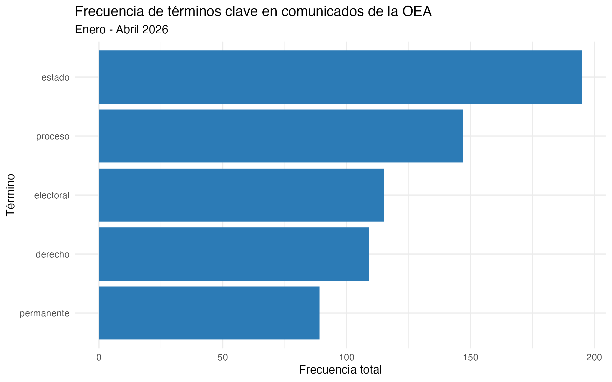

---

---

---
title: "Informe: Comunicados de Prensa de la OEA (Enero-Abril 2026)"
author: "Violeta Oxenford"
format: html
---

## Introducción

Este informe analiza los comunicados de prensa publicados por la Organización de los Estados Americanos (OEA) durante los primeros cuatro meses de 2026. El objetivo es identificar los temas más relevantes en la agenda institucional de la OEA a través del análisis de frecuencia de términos.

La pregunta que guía el análisis es: **¿Cuáles son los términos más frecuentes en los comunicados de prensa de la OEA en el período enero-abril 2026 y qué nos dicen sobre sus prioridades institucionales?**

## Estructura del proyecto

El proyecto está organizado en tres scripts principales dentro de `TP2/scripts/`:

-   `scraping_oea.R`: realiza el web scraping de los comunicados de prensa de la OEA para los meses de enero a abril de 2026, y guarda los resultados en formato `.rds` y `.html` en la carpeta `TP2/data/`.

-   `processing.R`: limpia el texto de los comunicados, lematiza usando el paquete `udpipe` con un modelo de español, filtra únicamente sustantivos, verbos y adjetivos, y remueve stopwords. El resultado se guarda en `TP2/output/`.

-   `metrics_figures.R`: calcula la frecuencia total de términos mediante una matriz de frecuencia de términos (DTM), selecciona 5 términos relevantes para el contexto institucional de la OEA y genera un gráfico de barras con `ggplot2`.

## Ejecución

```{r}
#| message: false
#| warning: false
library(here)
source(here("TP2/scripts/scraping_oea.R"))
source(here("TP2/scripts/processing.R"))
source(here("TP2/scripts/metrics_figures.R"))
```

## Resultados



## Interpretación

Los cinco términos más frecuentes en los comunicados de la OEA durante el período analizado (estado, proceso, electoral, derecho y permanente) reflejan las principales preocupaciones institucionales de la organización.

La alta frecuencia de "electoral" y "proceso" sugiere que la agenda de la OEA durante este período estuvo fuertemente orientada al monitoreo de procesos electorales en la región, lo cual es consistente con las misiones de observación en países como Colombia, Perú y Bolivia. El término "derecho" refleja el rol central de la defensa de derechos humanos y democráticos, mientras que "permanente" alude frecuentemente al Consejo Permanente, principal órgano político de la OEA.
